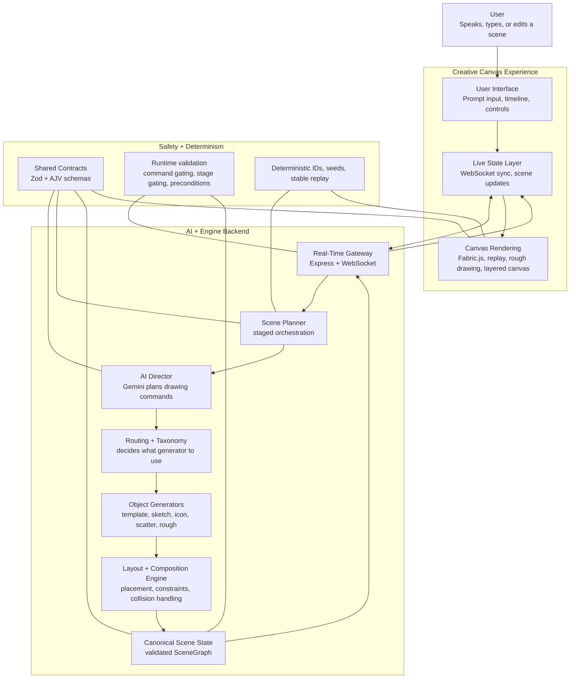
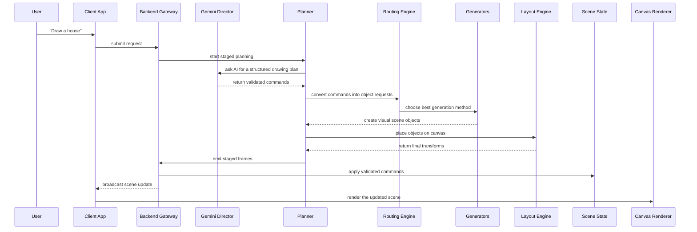
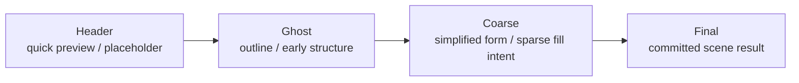
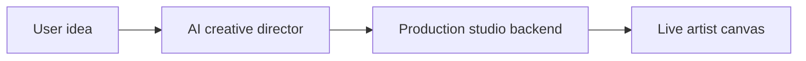

# AI Voice-to-Art Drawing System

Stakeholder architecture overview

## Executive summary

This product is an AI-assisted drawing system that turns a spoken or typed creative request into a structured visual scene.

It does not work like a basic "text-to-image" tool.

Instead, it works like a digital art studio:

- the user gives a creative instruction
- AI decides what should be drawn
- the backend decides how it should be constructed
- the frontend renders the drawing progressively on a canvas

This architecture gives us more control, more explainability, and a much better path for live interaction, editing, and future product growth.

## The big idea

Think of the system as a creative pipeline with specialized roles:

- **User** = the artist
- **Gemini** = the creative director
- **Backend engine** = the production studio
- **Canvas renderer** = the final exhibition surface

This means the AI is not painting directly.
The AI is planning.
Our system is the part that builds, organizes, validates, and displays the artwork.

## Stakeholder view: end-to-end architecture

## What happens when a user says "Draw a house"

## Why this architecture matters

### It is controllable

A plain text-to-image model gives one final output.
Our system gives structured scene objects, layers, revisions, and staged drawing behavior.

### It is explainable

We can show:

- what the AI decided
- which objects were created
- how they were placed
- what changed across stages

### It is interactive

Because the scene is structured, the user can:

- add to an existing scene
- move objects
- update composition
- commit or cancel previews
- support future voice-first live editing

### It is safer

The system validates every AI-generated envelope before applying it.
This reduces hallucinated commands and broken state transitions.

### It is extensible

We can improve:

- drawing styles
- layout intelligence
- object generators
- live collaboration

without rebuilding the entire product.

## Backend architecture: how the intelligence works

```mermaid
flowchart LR
  Input["User request<br/>voice or text"]
  Intent["Intent classification<br/>What kind of action is this?"]
  Director["Gemini Director<br/>Produces structured drawing commands"]
  Validate["Validation layer<br/>AJV + schema gates"]
  Extract["Request extraction<br/>objects + relations + passthrough edits"]
  Route["Routing engine<br/>taxonomy + generator selection"]
  Generate["Generators<br/>produce scene objects"]
  Compose["Layout engine<br/>positioning + collision resolution"]
  Stage["Stage transformer<br/>header -> ghost -> coarse -> final"]
  Apply["Apply to canonical SceneGraph"]
  Broadcast["Broadcast scene updates to client"]

  Input --> Intent --> Director --> Validate --> Extract --> Route --> Generate --> Compose --> Stage --> Apply --> Broadcast
```

### In simple language

The backend does six important jobs:

1. understands the request
2. asks the AI to make a structured plan
3. checks that the plan is valid
4. turns the plan into concrete visual objects
5. places those objects properly on the canvas
6. updates the scene and streams it to the UI

## How the system draws progressively

The drawing is not just "all at once".
It moves through stages.

### Why this matters

This staged model creates a more human and more engaging experience:

- the user sees progress early
- the system can refine before final commit
- the experience feels alive, not frozen
- it supports preview / commit / cancel workflows

## Main technologies used

| Layer | Technology | Role in the product |
| --- | --- | --- |
| Frontend | Vue 3 + Vite | Main web application UI |
| Real-time client | WebSocket | Live scene updates |
| Canvas interaction | Fabric.js | Object interaction, transforms, canvas management |
| Stylized rendering | RoughJS + replay pipeline | Artistic drawing feel |
| Backend | Node.js + Express | API and real-time orchestration |
| Live streaming | ws | WebSocket backend server |
| AI planning | Google Gemini | Converts requests into structured drawing commands |
| Voice input | Deepgram | Live speech streaming |
| Validation | Zod + AJV | Strong schema enforcement |
| Layout solving | Cassowary + collision logic | Composition, placement, layout stability |
| Determinism | Stable hashing / seeded replay | Consistent outputs and reproducible behavior |

## Core algorithms and system logic

The product combines multiple algorithmic layers rather than relying on a single AI output.

### Planning and interpretation

- intent classification
- prompt-to-command planning
- relation extraction from user language
- taxonomy lookup and semantic approximation
- candidate scoring for route selection

### Generation and placement

- route-based generator selection
- parametric template generation
- sketch-style generation
- icon and scatter generation
- deterministic object materialization

### Layout and composition

- ROI-based local layout solving
- constraint compilation
- Cassowary solving
- collision detection and resolution
- scatter placement for repeated objects

### Rendering and visual consistency

- staged rendering from header to final
- replay planning for animated drawing
- LOD-aware rendering policies
- seeded rough rendering and cache stability

## What makes this different from a standard AI drawing app

### Standard approach

- user enters prompt
- model returns one image
- limited editability
- weak explainability
- hard to support live object-level interaction

### Our approach

- user enters prompt
- AI returns structured commands
- engine creates and manages scene objects
- renderer draws those objects progressively
- future editing is object-based, not pixel-based

That is the architectural advantage.

## Business value of this approach

### Better product differentiation

This is not just another prompt-in, image-out experience.

### Better user trust

Because the system is staged, structured, and explainable.

### Better editing and collaboration potential

Because objects remain addressable and editable.

### Better future monetization surface

Because this architecture supports:

- premium styles
- live voice drawing
- object libraries
- composition assistants
- educational and creative tooling
- enterprise creative workflows

## Risks and what the architecture is designed to prevent

The architecture is built to reduce four major risks:

- **AI unpredictability**
  - controlled by strict schemas and validation gates

- **broken scene state**
  - controlled by canonical server-side scene ownership

- **poor composition**
  - controlled by routing, layout, and collision handling

- **inconsistent rendering**
  - controlled by deterministic seeds, stable replay, and staged rendering rules

This is important for stakeholder confidence:
the system is designed for controlled creativity, not uncontrolled generation.

## One-slide summary

**Our product is an AI-guided drawing studio, not a basic image generator.**

- Gemini decides what to draw
- the backend decides how to build and place it
- the frontend renders it progressively on a live canvas
- every step is validated, staged, and deterministic

That gives us:

- explainability
- editability
- live interaction
- product extensibility
- stronger long-term platform value

## Short speaker script

You can say this in a meeting:

> Our system works like a digital art studio.
> The user gives a voice or text instruction.
> Gemini acts as the creative director and produces a structured plan, not raw pixels.
> Our backend then validates that plan, turns it into scene objects, decides which generation method to use, lays those objects out properly, and applies them to a canonical scene model.
> The frontend receives that structured scene and renders it progressively on a layered canvas.
> This makes the product more interactive, more explainable, and much more scalable than a standard text-to-image approach.

## Simple visual metaphor

With explanation:

- **AI creative director** = decides the plan
- **Production studio backend** = builds the artwork correctly
- **Live artist canvas** = shows the evolving result

## Repo code map

Useful files for technical follow-up:

- `server/routes.ts`
- `server/streaming/planGenerator.ts`
- `server/gemini/commandDirector.ts`
- `server/engine/routing/planToObjectRequests.ts`
- `server/engine/routing/routeObjectRequest.ts`
- `server/engine/generators/materialize.ts`
- `server/engine/layout/layoutEngine.ts`
- `client/src/state/wsStore.ts`
- `client/src/render/sandwich/CanvasSandwich.vue`
- `client/src/render/sandwich/fabricHost.ts`
- `shared/schema.ts`
- `shared/scene.ts`
- `shared/commands.ts`
- `shared/validators/commandEnvelopeSchemaV11.ts`
